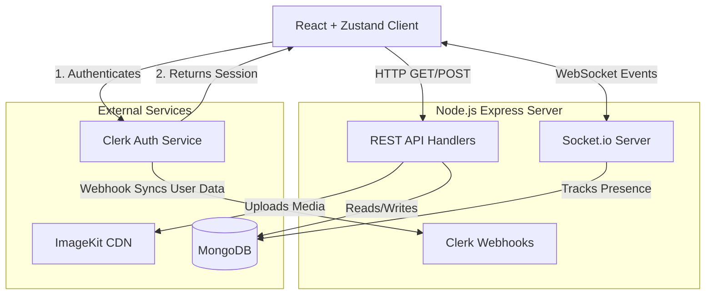
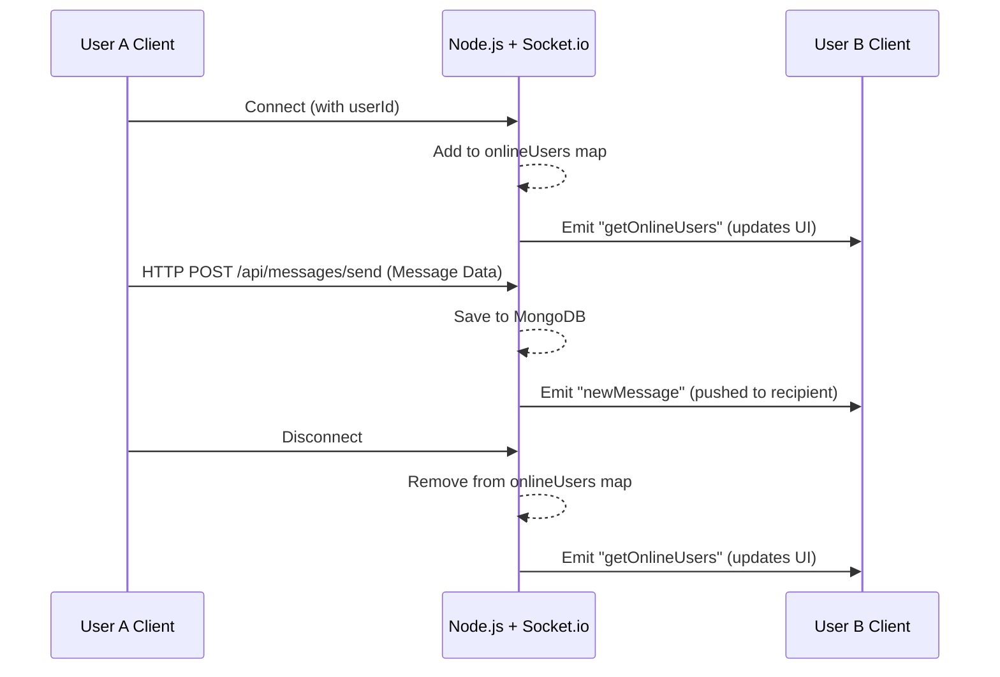

# SocketSphere 💬

A modern, full-stack real-time chat application built with the MERN stack and WebSockets. Designed to deliver instant messaging, live online presence tracking, and secure user authentication with a highly responsive user interface.

---

## ✨ Features

- 🔐 **Secure Authentication** — Enterprise-grade authentication powered by Clerk (OAuth + Email).
- ⚡ **Real-Time Messaging** — Instant, bidirectional message delivery using Socket.io WebSockets (zero polling, zero page refreshes).
- 🟢 **Live Online Status** — Real-time tracking of user presence, instantly broadcasting when users come online or go offline.
- 💬 **Persistent Conversation History** — All message threads are securely stored in MongoDB and loaded dynamically.
- 🖼️ **Media Sharing** — Built-in support for sharing images and videos, uploaded and optimized via the ImageKit CDN.
- 📱 **Responsive UI** — Fully responsive design that adapts flawlessly from desktop to mobile screens using an intuitive sidebar layout.

---

## 🏗️ System Architecture

SocketSphere utilizes a hybrid architecture, leveraging REST APIs for standard CRUD operations and WebSockets strictly for low-latency, real-time push events.



### 📡 Real-Time Event Flow (Socket.io)



---

## 🛠️ Tech Stack

### Frontend
| Technology | Purpose |
|---|---|
| **React 19** | Core UI component library |
| **Vite** | Blazing fast dev server and bundler |
| **Tailwind CSS v4** | Utility-first styling framework |
| **Zustand** | Lightweight, boilerplate-free global state management |
| **Clerk React** | Client-side session and authentication management |
| **Socket.io-Client** | Persistent WebSocket connection |
| **Axios** | Handling HTTP REST API requests |

### Backend
| Technology | Purpose |
|---|---|
| **Node.js + Express** | Robust REST API server framework |
| **Socket.io** | WebSocket server for real-time, bidirectional events |
| **MongoDB + Mongoose** | NoSQL database with strict schema modeling |
| **Clerk SDK** | Server-side authentication and route protection |
| **ImageKit** | Media storage and Content Delivery Network (CDN) |
| **Multer** | Middleware for handling `multipart/form-data` uploads |

---

## 🛣️ API Routes & Endpoints

SocketSphere's backend is structured to cleanly separate authentication, messaging, and webhooks.

### Authentication (`/api/auth`)
| Route | Method | Description |
|---|---|---|
| `/check` | `GET` | Validates the current user's session token and returns their synced profile data from MongoDB. Protected by Clerk middleware. |

### Messaging (`/api/messages`)
| Route | Method | Description |
|---|---|---|
| `/users` | `GET` | Retrieves all registered users in the system to populate the "New Chat" or "People" tab. |
| `/conversations` | `GET` | Fetches a list of users the current user has already exchanged messages with, including a preview of the last message sent. Uses a MongoDB aggregation pipeline. |
| `/:id` | `GET` | Fetches the complete message history between the authenticated user and the specified user `id`. |
| `/send/:id` | `POST` | Sends a new text or media message to the specified `id`. Handles file uploads via Multer and ImageKit, saves to MongoDB, and triggers a Socket.io push event. |

### Webhooks (`/api/webhooks`)
| Route | Method | Description |
|---|---|---|
| `/clerk` | `POST` | Listens for user creation/update/deletion events from Clerk and securely syncs this data into the local MongoDB instance. |

---

## ⚙️ Getting Started

### Prerequisites
- Node.js (v18+)
- MongoDB connection string (Local or Atlas)
- Clerk account (for authentication)
- ImageKit account (for media uploads)

### 1. Clone the Repository
```bash
git clone https://github.com/SiddhantRoy/socketsphere.git
cd socketsphere
```

### 2. Setup Backend Environment
```bash
cd backend
npm install
```
Create a `.env` file in the `/backend` directory:
```env
PORT=3000
MONGODB_URI=your_mongodb_connection_string
CLERK_SECRET_KEY=your_clerk_secret_key
CLERK_PUBLISHABLE_KEY=your_clerk_publishable_key
FRONTEND_URL=http://localhost:5173
IMAGEKIT_PUBLIC_KEY=your_imagekit_public_key
IMAGEKIT_PRIVATE_KEY=your_imagekit_private_key
IMAGEKIT_URL_ENDPOINT=your_imagekit_url_endpoint
CLERK_WEBHOOK_SIGNING_SECRET=your_clerk_webhook_secret
```
Run the server:
```bash
npm run dev
```

### 3. Setup Frontend Environment
```bash
cd ../frontend
npm install
npm run dev
```
The frontend will start on `http://localhost:5173`.

---

## 🔑 Key Concepts Demonstrated

- **WebSocket Event Lifecycle** — Managing connections, message emissions, room targeting, and disconnection cleanup without memory leaks.
- **Zustand State Management** — Architecting robust global stores for messages and user states without the heavy boilerplate of Redux.
- **REST + WebSocket Hybrid Pattern** — Strategically using HTTP for heavy CRUD operations (fetching history) and WebSockets strictly for real-time push events.
- **Auth Middleware Pattern** — Securing sensitive routes with Clerk's Express middleware, validating tokens before hitting controllers.
- **Mongoose Aggregation Pipelines** — Utilizing advanced MongoDB operations (`$group`, `$lookup`, `$replaceRoot`, `$sort`) to build high-performance data queries for the conversations sidebar.

---

## 👨‍💻 Author

**Siddhant Roy**  
B.Tech Computer Science (2nd Year)  

---

## 📄 License

This project is licensed under the MIT License - feel free to use it for learning purposes.
