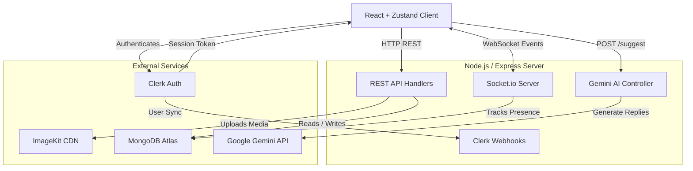
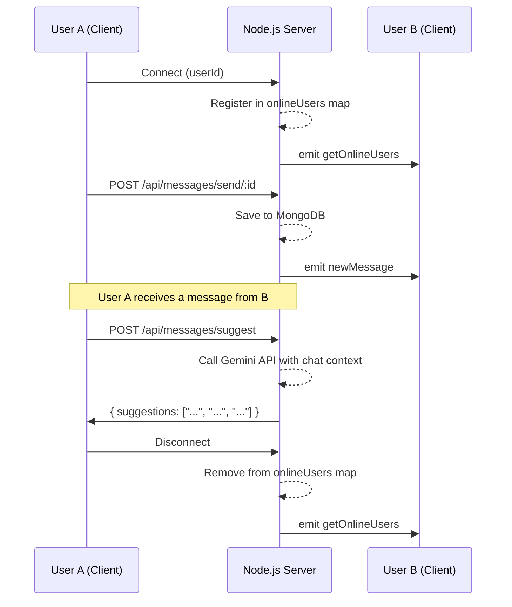

<div align="center">

# SocketSphere 💬

**A production-grade, full-stack real-time chat application**

[](https://react.dev)
[](https://nodejs.org)
[](https://mongodb.com)
[](https://socket.io)
[](https://docker.com)
[](LICENSE)

Built with the MERN stack and WebSockets. Delivers instant messaging, live presence tracking, AI-powered smart replies, and secure authentication — all in a fully responsive interface.

**[🚀 Live Demo →](https://socketsphere-bve8.onrender.com)**

</div>

---

## ✨ Features

| Feature | Description |
|---|---|
| 🔐 **Secure Authentication** | Enterprise-grade auth via Clerk — supports OAuth (Google, GitHub) and Email/Password |
| ⚡ **Real-Time Messaging** | Instant bidirectional message delivery over Socket.io WebSockets (zero polling) |
| 🤖 **AI Smart Replies** | Gemini-powered reply suggestions that appear contextually after every received message |
| 🟢 **Live Online Presence** | Real-time online/offline status tracking broadcast to all connected clients |
| 💬 **Persistent History** | All conversations stored in MongoDB and loaded dynamically on conversation open |
| 🖼️ **Media Sharing** | In-chat image and video sharing, uploaded and optimized through ImageKit CDN |
| 📱 **Fully Responsive** | Adaptive layout that works seamlessly from mobile to widescreen desktop |
| 🐳 **Docker Ready** | Multi-stage Docker build pipeline for optimized, production-ready container deployments |

---

## 🏗️ System Architecture

SocketSphere uses a **hybrid architecture** — REST APIs for standard CRUD operations, and WebSockets exclusively for low-latency real-time push events. The Gemini API is integrated server-side to keep the API key secure.



### 📡 Real-Time Event Flow



---

## 🛠️ Tech Stack

### Frontend
| Technology | Version | Purpose |
|---|---|---|
| **React** | 19 | Core UI component library |
| **Vite** | 8 | Blazing-fast dev server & bundler |
| **Tailwind CSS** | v4 | Utility-first styling framework |
| **Zustand** | 5 | Lightweight global state management |
| **Clerk React** | 6 | Client-side session & auth UI |
| **Socket.io-Client** | 4 | Persistent WebSocket connection |
| **Axios** | 1 | HTTP REST API client |
| **Lucide React** | latest | Icon library |

### Backend
| Technology | Version | Purpose |
|---|---|---|
| **Node.js + Express** | 22 / 5 | REST API server |
| **Socket.io** | 4 | Real-time bidirectional event engine |
| **MongoDB + Mongoose** | Atlas / 9 | NoSQL database with schema modeling |
| **Clerk SDK** | 2 | Server-side auth middleware & webhook handling |
| **ImageKit** | 7 | Media storage & CDN delivery |
| **Multer** | 2 | Multipart form-data file upload middleware |
| **@google/genai** | latest | Gemini AI SDK for smart reply generation |

### DevOps & Deployment
| Technology | Purpose |
|---|---|
| **Docker** | Multi-stage builds — separates build env from production runner |
| **Render** | Cloud hosting for the containerized application |

---

## 🤖 AI Smart Reply — How It Works

When the other person sends a message, SocketSphere automatically fetches 3 short, contextual reply suggestions powered by the **Gemini API**.

```
┌─────────────────────────────────────────────────────┐
│  Them: "did you watch Interstellar?"                │
│                                                     │
│  ✨  Not yet!    Yes, it's great!    It's amazing!  │ ← click to fill composer
│  ┌─────────────────────────────────────────────┐   │
│  │  Message...                             [→] │   │
│  └─────────────────────────────────────────────┘   │
└─────────────────────────────────────────────────────┘
```

**Flow:**
1. Receiver gets a new message → `SmartReplies` component detects it's the other person's turn
2. Frontend sends the last 10 text messages to `POST /api/messages/suggest`
3. Backend builds a conversation transcript and calls Gemini with a structured prompt
4. Gemini returns a JSON array of 3 short replies → displayed as clickable chips
5. Clicking a chip fills the composer — user can edit or send directly

---

## 🛣️ API Reference

### Authentication — `/api/auth`
| Method | Route | Auth | Description |
|---|---|---|---|
| `GET` | `/check` | ✅ Required | Validates session token, returns synced MongoDB user profile |

### Messaging — `/api/messages`
| Method | Route | Auth | Description |
|---|---|---|---|
| `GET` | `/users` | ✅ Required | All users in the system (for "New Chat" / People tab) |
| `GET` | `/conversations` | ✅ Required | Conversations list with last-message preview (MongoDB aggregation pipeline) |
| `GET` | `/:id` | ✅ Required | Full message history between the current user and `:id` |
| `POST` | `/send/:id` | ✅ Required | Send a text or media message; handles Multer upload → ImageKit → MongoDB → Socket.io emit |
| `POST` | `/suggest` | ✅ Required | Generate 3 AI smart reply suggestions via Gemini API |

### Webhooks — `/api/webhooks`
| Method | Route | Description |
|---|---|---|
| `POST` | `/clerk` | Clerk event listener — syncs user create/update/delete events into MongoDB |

---

## ⚙️ Getting Started

### Prerequisites

- Node.js `v18+`
- MongoDB connection string (local or Atlas)
- [Clerk](https://clerk.com) account — for authentication
- [ImageKit](https://imagekit.io) account — for media storage
- [Google AI Studio](https://aistudio.google.com) API key — for smart replies

### 1. Clone the Repository

```bash
git clone https://github.com/Sid-LD/SocketSphere.git
cd SocketSphere
```

### 2. Backend Setup

```bash
cd backend
npm install
```

Create a `.env` file in the `/backend` directory:

```env
PORT=3000
MONGODB_URI=your_mongodb_connection_string

CLERK_SECRET_KEY=your_clerk_secret_key
CLERK_PUBLISHABLE_KEY=your_clerk_publishable_key
CLERK_WEBHOOK_SIGNING_SECRET=your_clerk_webhook_secret

IMAGEKIT_PUBLIC_KEY=your_imagekit_public_key
IMAGEKIT_PRIVATE_KEY=your_imagekit_private_key
IMAGEKIT_URL_ENDPOINT=your_imagekit_url_endpoint

GEMINI_API_KEY=your_google_ai_studio_api_key

FRONTEND_URL=http://localhost:5173
NODE_ENV=development
```

Start the backend:

```bash
npm run dev   # starts on http://localhost:3000
```

### 3. Frontend Setup

```bash
cd ../frontend
npm install
npm run dev   # starts on http://localhost:5173
```

### 4. Docker (Production)

```bash
# From the project root
docker build \
  --build-arg VITE_CLERK_PUBLISHABLE_KEY=your_clerk_publishable_key \
  -t socketsphere .

docker run -p 3001:3001 \
  -e MONGODB_URI=... \
  -e CLERK_SECRET_KEY=... \
  -e GEMINI_API_KEY=... \
  socketsphere
```

---

## 🔑 Key Engineering Concepts

| Concept | Implementation |
|---|---|
| **WebSocket Lifecycle** | Connections, emissions, room targeting, and disconnection cleanup — zero listener leaks via `socket.off()` before every `socket.on()` |
| **REST + WebSocket Hybrid** | HTTP for heavy CRUD (fetch history), WebSockets only for real-time push — minimizes unnecessary socket traffic |
| **Zustand State Architecture** | Single `useChatStore` as the source of truth for messages, conversations, composer state, and media upload flags |
| **Auth Middleware** | Clerk Express middleware validates JWT on every protected route before the controller runs |
| **MongoDB Aggregation** | `$group → $sort → $lookup → $replaceRoot → $project` pipeline powers the conversations sidebar with last-message previews |
| **Multi-Stage Docker Build** | Stage 1: Vite SPA build → Stage 2: Express bundle → Stage 3: Production runner (no dev dependencies, minimal image size) |
| **AI Integration** | Gemini API called server-side (keeps API key secure); conversation context windowed to last 10 messages for efficiency |

---

## 👨‍💻 Author

**Siddhant Roy**
B.Tech Electronics and Communication Engineering — 3rd Year

[](https://github.com/Sid-LD)

---

## 📄 License

This project is licensed under the **MIT License** — feel free to use it for learning and personal projects.
